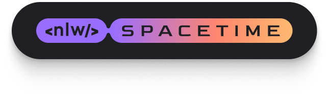

<h1 align="center">
  <br>
  <a href=""></a>
  <br>
  NLW Spacetime Web
  <br>
</h1>

<h4 align="center">Uma aplicação de linha do tempo desenvolvido por <a href="https://github.com/M4ciel" target="_blank">M4ciel</a>.</h4>

<p align="center">
  <!-- <a href="https://badge.fury.io/js/electron-markdownify">
    
  </a>
  <a href="https://gitter.im/amitmerchant1990/electron-markdownify"></a>
  <a href="https://saythanks.io/to/bullredeyes@gmail.com">
      
  </a>
  <a href="https://www.paypal.me/AmitMerchant">
    
  </a> -->
</p>

<p align="center">
  <a href="#tecnologias">Tecnologias</a> •
  <a href="#como-usar">Como Usar</a> •
  <a href="#acesso">Acesso</a> •
  <a href="#créditos">Créditos</a> •
  <a href="#suporte">Suporte</a> •
  <a href="#licença">Licença</a>
</p>


## Tecnologias

### Backend

* NodeJs
* ReactJS
* TailwindCss
* NextJs

## Como Usar

Para clonar e rodar essa aplicação, você vai precisar do [Git](https://git-scm.com) e do [Node.js](https://nodejs.org/en/download/) (Que vem com o [npm](http://npmjs.com)) instalados no seu computador. Do seu terminal:

```bash
# Clone esse repositório
$ git clone https://github.com/M4ciel/nlw-spacetime-server.git

# Entre na pasta
$ cd nlw-spacetime-server

# Instale as dependências
$ npm install

# Rode a aplicação
$ npm start
```

> **Nota**
> Se você está usando o Linux Bash for Windows, [veja esse guia](https://www.howtogeek.com/261575/how-to-run-graphical-linux-desktop-applications-from-windows-10s-bash-shell/) ou use `node` do terminal de comando.


## Acesso

Acesse ao site clicando [aqui]()

## Créditos

Essa aplicação teve como contruibuintes:

- [M4ciel](https://github.com/M4ciel)
- [Node.js](https://nodejs.org/)
- [Rocketseat](https://www.rocketseat.com.br)


## Suporte

<a href="https://bmc.link/caiomaciel" target="_blank"></a>

---

## Licença

MIT